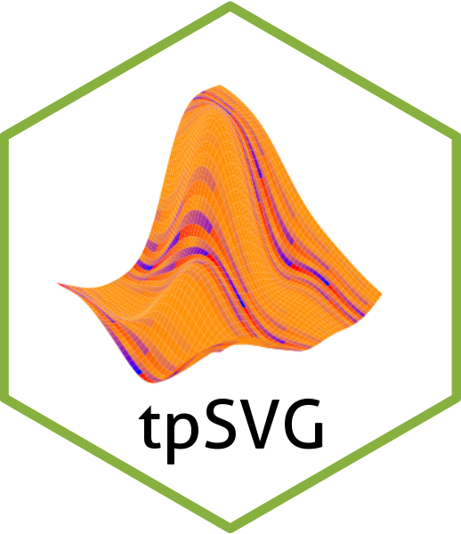

# tpSVG 


<!-- badges: start -->
[](https://lifecycle.r-lib.org/articles/stages.html#experimental)
[](https://github.com/boyiguo1/tpSVG/actions)
<!-- badges: end -->

The goal of `tpSVG` is to detect and visualize spatial variation in the gene expression for spatially resolved transcriptomics data analysis. Specifically, `tpSVG` introduces a family of count-based models, with generalizable parametric assumptions such as Poisson distribution or negative binomial distribution. In addition, comparing to currently available count-based model for spatially resolved data analysis, the `tpSVG` models improves computational time, and hence greatly improves the applicability of count-based models in SRT data analysis. 


## Installation

You can install the development version of tpSVG from [GitHub](https://github.com/boyiguo1/tpSVG) with:

```{r}
# install.packages("devtools")
devtools::install_github("boyiguo1/tpSVG")
```

## Tutorial

Please find an end-to-end tutorial at https://boyi-guo.com/tpSVG/articles/intro_to_tpSVG.html.


## Frequently asked questions

__Implementation Questions__

* What are the data structures that `tpSVG` current supports?

  _As of `tpSVG v0.99.1`, the data structure `tpSVG` supports includes [`SpatialExperiments`](https://bioconductor.org/packages/release/bioc/html/SpatialFeatureExperiment.html) (and packages extending `SpatialExperiments`, e.g.  [`SpatialFeatureExperiments`](https://bioconductor.org/packages/release/bioc/html/SpatialFeatureExperiment.html)) and `data.frame`. Please find example via [supported_data_structure](https://boyi-guo.com/escheR/articles/supported_data_structure.html). Due to limited resources, we regret that we won't provides direct accessibility to other pipelines, e.g. `suerat`._

* What types of spatially-resolved transcriptomics (SRT) data that `tpSVG` supports?
Both sequenced-based SRT and image-based SRT are supported by `tpSVG`. For more details, please refer to xxx.


__Theoretical Questions__

* What is the difference between modeling normalized data and count-based model?

  _[TODO: revise this section] and  of spatial count-based model the to provide convinience in practice, to directly model the gene expression in its natural form, in contrast to additional arithmetic transformation, e.g. log transformation, that could introduce additional bias in the analysis. As a result, `tpSVG`_ 

* 


* 


